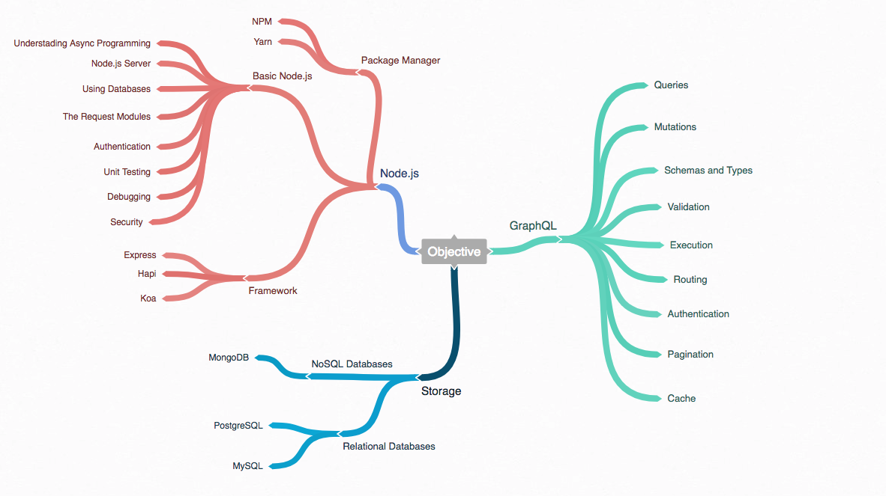

# Learn Node.js and GraphQL

## Roadmap

## Prepare

### Learn Node.js

- Learn Package Manager
  + NPM
  + Yarn
- Basic Node.js
  + Understading Async Programming
  + Node.js Server
  + Using Databases
  + The Request Modules
  + Authentication
  + Unit Testing
  + Debugging
  + Security
- Framework
  + Express
  + Hapi
  + Koa

### Learn GraphQL

- What is GraphQL?
- GraphQL
  + Hierarchical
  + Product-centric
  + Strong-type
  + Client-specified queries
  + Introspective
- Beginner with GraphQL
  + Queries
  + Mutations
  + Schemas and Types
  + Validation
  + Execution
  + Routing
  + Authentication
  + Pagination
  + Cache

## Objectives

- Create APIs using Node.js and GraphQL
  + Use GraphQL on the Frontend using Vue.js and Apollo
  + Build GraphQL Server using Node.js
- Deployment on Surge or Now

